# Java 網路程式設計

## 網絡通信：網路編程概述

- 基本的通信架構有2種形式：CS架構（Client 客戶端 / Server 服務端），BS架構（Browser 瀏覽器 / Server 服務端）


- **CS 架構**
  - Client：需要程序員開發，用戶需要安裝
  - Server：需要程序員開發

- **BS 架構**
  - Browser：不需要程序員開發實現，用戶需要安裝瀏覽器。
  - Server：需要程序員開發

## 網絡通信三要素

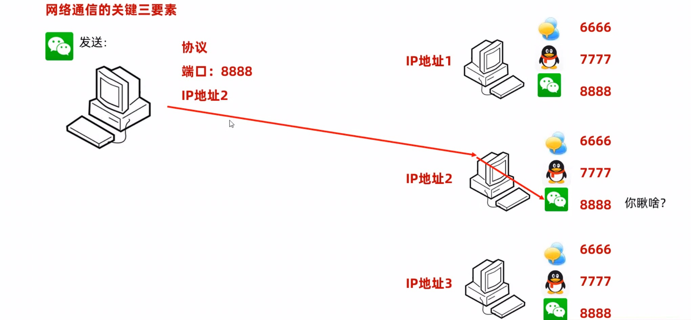

### IP 地址（Internet Protocol）

1. 全稱“互聯網協議地址”，是設備在網路中的地址，是唯一的標識。
2. IP地址有兩種形式：IPV4，IPV6

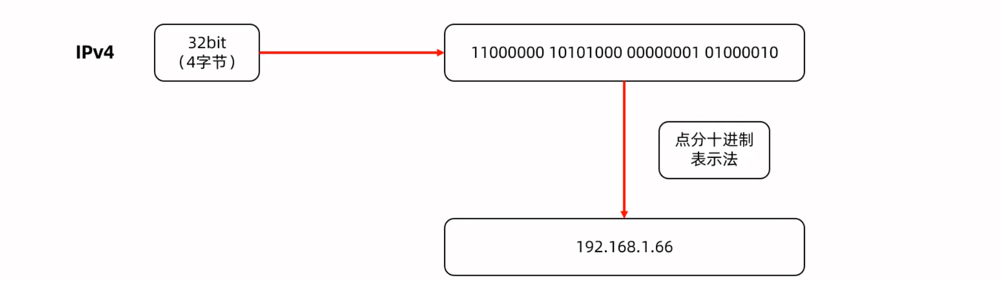

#### IPV6

1. 供128位，號稱可以為地球每一粒沙子編號。
2. IPV6分成8段表示，每段每四位變化成一個16進制位數表示，數之間使用（：）分開。

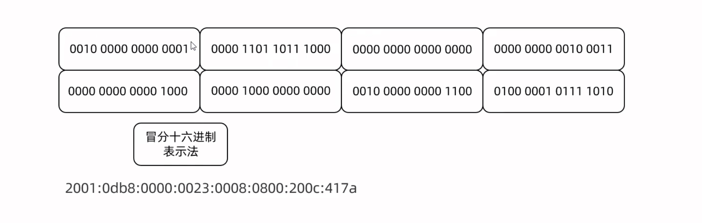

#### IP 域名

如果第一次訪問沒有訪問過這個域名，會先把域名發送給運營商的服務器，隨後運營商的服務器找到域名的IP，最後把真實的IP發送到個人的dns服務器。

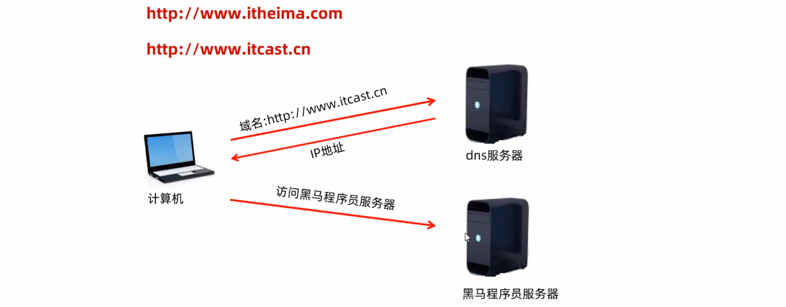

##### 公網 IP

是可以連接互聯網的 IP 地址。

##### 內網 IP

也叫做局域網 IP，只能組織機構內部使用。

192.168開頭的就是常見的局域網地址，範圍即為192.168.0.0--192.168.255.255，專門為組織機構內部使用。

##### 特殊 IP 地址

127.0.0.1，localhost：代表本機 IP，只會尋找當前所在的主機。

##### IP 常用命令

`ipconfig`：查看本機 IP 地址。

`ping IP地址`：檢查網路是否聯通。

#### InetAddress

代表 IP 地址

**InetAddress**常用方法

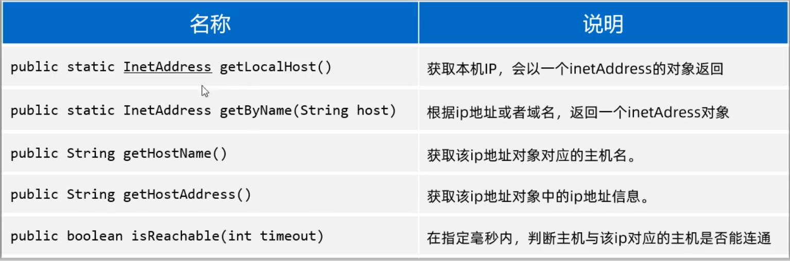

```java
package com.ip;

import java.net.InetAddress;
public class InetAddressTest {
    public static void main(String[] args) throws Exception {
        // 1. 获取本机 IP 地址对象
        InetAddress ip = InetAddress.getLocalHost();
        System.out.println(ip.getHostName());   // 本机名
        System.out.println(ip.getHostAddress()); // 本机 IP 地址

        // 获取指定 IP 或者域名的 IP地址对象
        InetAddress ip1 = InetAddress.getByName("www.bing.com");
        System.out.println(ip1.getHostName());   // 域名
        System.out.println(ip1.getHostAddress()); // IP 地址

        // ping www.bing.com
        System.out.println(ip1.isReachable(5000));  // 5 秒钟内就可以连通，反之则不行;
    }
}
```

### 端口

應用程式在設備中唯一的標識。標記正在計算機設備商運行的應用程式的，被規定為一個16位的二進制，範圍是0 ~ 65536

#### 分類：

1. 周知端口：0 ~ 1023，被預先定義的知名程式佔用（如：HTTP佔用80，FTP佔用21）。
2. 註冊端口：1024 ~ 49151，分配給用戶進程或某些應用程式。
3. 動態端口： 49152 ~ 65535，之所以被稱之為動態端口，是因為它一般不固定分配某種進程，而是動態分配。

> 注意：自己開發的程式一般選擇使用註冊端口，且一個設備中不能出現兩個程式端口號一樣，否則出錯。

### 協議

**連接和數據在網路中傳輸的規則。**

**通信協議**：網路上通信的設備，事先規定的鏈接規則，以及傳輸數據的規則，以及傳輸數據的規則被稱為網路通信協議。

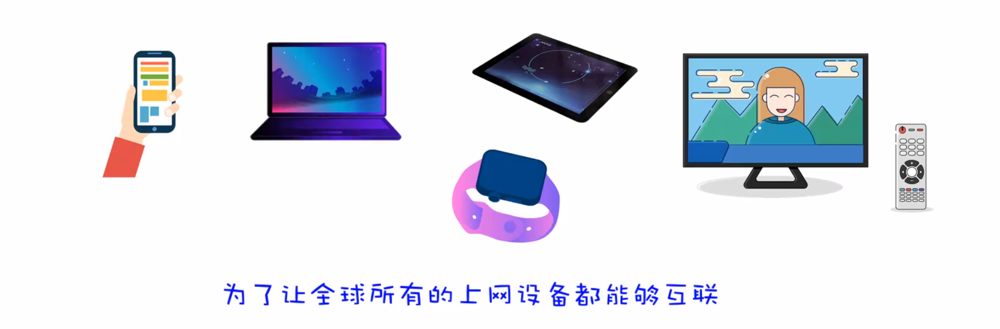

#### **開放式網路互聯標準：OSI參考模型**

- OSI網路參考模型：全球網路互聯標準。
- TCP / IP網絡模型：事實上的國際標準。

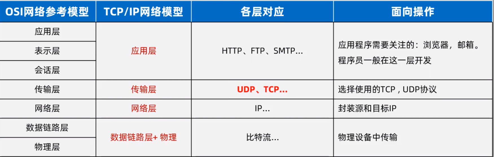

#### UDP（User Datagram Protocol）：用戶數據報協議

- 特點：無連接，不可靠通信，通信效率高。
- 不事先建立連接，數據按照包發，一包數據包含：自己的 IP，程序端口，目的地 IP，程序端口和數據（限製在64KB內）等。
- 發送方不管對方是否在線，數據在中間丟失也不管，如果接收方收到數據頁也不返回確認，故是不可靠的。
- 語音通話，視頻直播可以使用UDP。

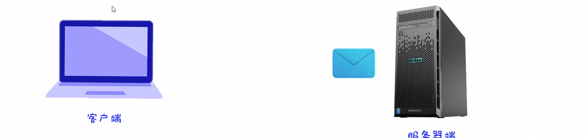

#### TCP（Transmission Control Protocol）：傳輸控制協議

- 特點：面向鏈接，可靠通信，通信效率相對不高。
- TCP最終目的：要保證在不可靠的信道上實現可靠的傳輸。
- 三個步驟實現可靠傳輸：三次握手建立連接，傳輸數據進行確認，四次揮手段考連接。
- 網頁，文件下載，支付。

#### TCP協議：三次握手建立可靠連接

**可靠連接：**確定通信雙方，收發消息都是正常無問題的 [全雙工]

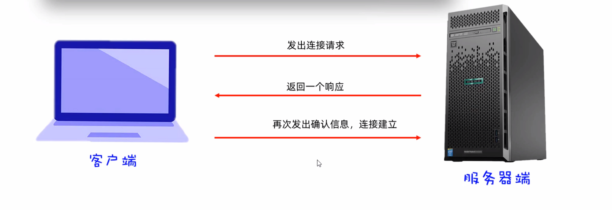

**為什麼要三次握手才能建立連接？**

最關鍵的原因是為了**防止已失效的連接請求報文段突然又傳到了服務器，因而產生錯誤。**

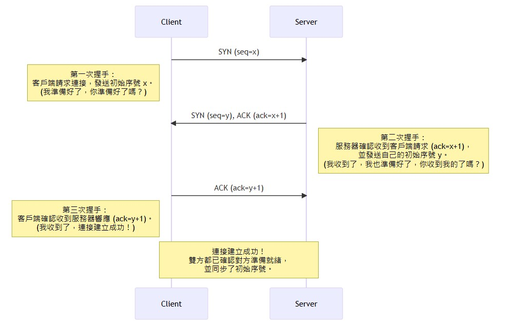

#### TCP協議：四次揮手斷開連接

**目的：確保雙方數據的收發都已經完成**

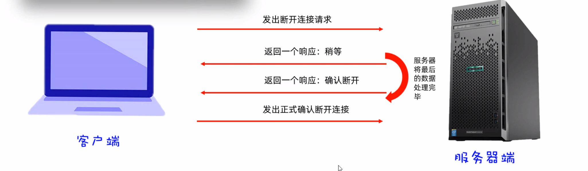

## UDP通信：客戶端發訊息

### UDP通信：快速入門

1. 特點：無連接，不可靠通信，通信效率高。
2. 不事先建立連接，數據按照包發，一包數據包含：自己的 IP，程序端口，目的地 IP，程序端口和數據（限製在64KB內）等。
3. Java提供了一個`java.net.DatagramSocket`類來實現UDP通信。
4. 要有一個發送端（客戶端），還要有一個接收端（服務端）。

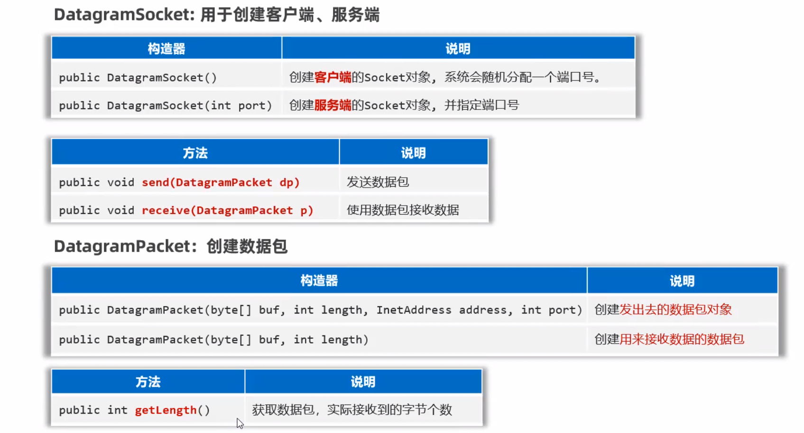

```java
package udp1;

import java.net.DatagramPacket;
import java.net.DatagramSocket;
import java.net.InetAddress;

/**
 * @ClassName Client
 * @Author Cecilia
 * @Date 2025/7/20
 */
public class Client {
    public static void main(String[] args) throws Exception {
        // 1. 创建客户端对象（发数据包出去）
        DatagramSocket socket = new DatagramSocket(7777);

        // 2. 创建数据包对象封装要发出去的数据
        /**
         *     public DatagramPacket(byte buf[], int length, InetAddress address, int port)
         *     buf: 封装要发出去的数据
         *     length: 发送出去数据大小 [字节个数]
         *     address: 服务端 IP 地址 [找到服务端的主机]
         *     port: 服务端程序的端口
         */
        byte[] bytes = "HELLO WORLD".getBytes(); // 转换成一个字节数组：getBytes()
        DatagramPacket packet = new DatagramPacket(bytes, bytes.length, InetAddress.getLocalHost(), 6666);

        // 开始发送数据包
        socket.send(packet);
        System.out.println("客户端数据发送完毕");
        socket.close();  // 释放资源
    }
}
```


```java
package udp1;

import java.net.DatagramPacket;
import java.net.DatagramSocket;

/**
 * @ClassName Server
 * @Author Cecilia
 * @Date 2025/7/20
 */
public class Server {
    public static void main(String[] args) throws Exception {
        System.out.println("服务端启动。");
        // 创建一个服务端对象（创建一个接收数据包的人） 注册端口
        DatagramSocket socket = new DatagramSocket(6666);

        // 创建一个数据包对象，用于接收数据的（创建一个数据盘子用来接收数据）
        byte[] buffer = new byte[1024 * 64];  // 64KB
        DatagramPacket packet = new DatagramPacket(buffer, buffer.length);

        // 接收客户端发来的数据，收到数据后才会往下走
        socket.receive(packet);

        // 从字节数组中把接收到的数据直接打印出来
        // 接收多少拿出多少
        // 获取本次数据包接收了多少数据
        int len = packet.getLength();

        String string =  new String(buffer, 0, len);
        System.out.println(string);

        System.out.println(packet.getAddress().getHostAddress());
        System.out.println(packet.getPort()); // 获取端口

        socket.close();
    }
}
```

### UDP通信：多發多收

## TCP通信

### TCP通信：快速入門

### TCP通信：多發多收

### TCP通信：支持與多個客戶端同時通信

### TCP通信：綜合案例
