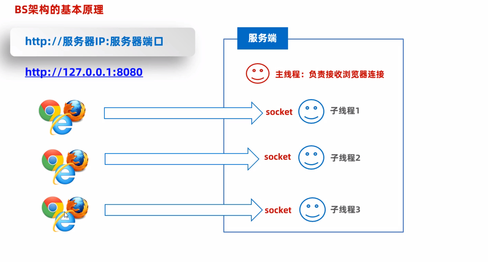

# Java 網路程式設計

## 網絡通信：網路編程概述

- 基本的通信架構有2種形式：CS架構（Client 客戶端 / Server 服務端），BS架構（Browser 瀏覽器 / Server 服務端）


- **CS 架構**
  - Client：需要程序員開發，用戶需要安裝
  - Server：需要程序員開發

- **BS 架構**
  - Browser：不需要程序員開發實現，用戶需要安裝瀏覽器。
  - Server：需要程序員開發

## 網絡通信三要素


### IP 地址（Internet Protocol）

1. 全稱“互聯網協議地址”，是設備在網路中的地址，是唯一的標識。
2. IP地址有兩種形式：IPV4，IPV6


#### IPV6

1. 供128位，號稱可以為地球每一粒沙子編號。
2. IPV6分成8段表示，每段每四位變化成一個16進制位數表示，數之間使用（：）分開。


#### IP 域名

如果第一次訪問沒有訪問過這個域名，會先把域名發送給運營商的服務器，隨後運營商的服務器找到域名的IP，最後把真實的IP發送到個人的dns服務器。


##### 公網 IP

是可以連接互聯網的 IP 地址。

##### 內網 IP

也叫做局域網 IP，只能組織機構內部使用。

192.168開頭的就是常見的局域網地址，範圍即為192.168.0.0--192.168.255.255，專門為組織機構內部使用。

##### 特殊 IP 地址

127.0.0.1，localhost：代表本機 IP，只會尋找當前所在的主機。

##### IP 常用命令

`ipconfig`：查看本機 IP 地址。

`ping IP地址`：檢查網路是否聯通。

#### InetAddress

代表 IP 地址

**InetAddress**常用方法


```java
package com.ip;

import java.net.InetAddress;
public class InetAddressTest {
    public static void main(String[] args) throws Exception {
        // 1. 获取本机 IP 地址对象
        InetAddress ip = InetAddress.getLocalHost();
        System.out.println(ip.getHostName());   // 本机名
        System.out.println(ip.getHostAddress()); // 本机 IP 地址

        // 获取指定 IP 或者域名的 IP地址对象
        InetAddress ip1 = InetAddress.getByName("www.bing.com");
        System.out.println(ip1.getHostName());   // 域名
        System.out.println(ip1.getHostAddress()); // IP 地址

        // ping www.bing.com
        System.out.println(ip1.isReachable(5000));  // 5 秒钟内就可以连通，反之则不行;
    }
}
```

### 端口

應用程式在設備中唯一的標識。標記正在計算機設備商運行的應用程式的，被規定為一個16位的二進制，範圍是0 ~ 65536

#### 分類：

1. 周知端口：0 ~ 1023，被預先定義的知名程式佔用（如：HTTP佔用80，FTP佔用21）。
2. 註冊端口：1024 ~ 49151，分配給用戶進程或某些應用程式。
3. 動態端口： 49152 ~ 65535，之所以被稱之為動態端口，是因為它一般不固定分配某種進程，而是動態分配。

> 注意：自己開發的程式一般選擇使用註冊端口，且一個設備中不能出現兩個程式端口號一樣，否則出錯。

### 協議

**連接和數據在網路中傳輸的規則。**

**通信協議**：網路上通信的設備，事先規定的鏈接規則，以及傳輸數據的規則，以及傳輸數據的規則被稱為網路通信協議。


#### **開放式網路互聯標準：OSI參考模型**

- OSI網路參考模型：全球網路互聯標準。
- TCP / IP網絡模型：事實上的國際標準。


#### UDP（User Datagram Protocol）：用戶數據報協議

- 特點：無連接，不可靠通信，通信效率高。
- 不事先建立連接，數據按照包發，一包數據包含：自己的 IP，程序端口，目的地 IP，程序端口和數據（限製在64KB內）等。
- 發送方不管對方是否在線，數據在中間丟失也不管，如果接收方收到數據頁也不返回確認，故是不可靠的。
- 語音通話，視頻直播可以使用UDP。


#### TCP（Transmission Control Protocol）：傳輸控制協議

- 特點：面向鏈接，可靠通信，通信效率相對不高。
- TCP最終目的：要保證在不可靠的信道上實現可靠的傳輸。
- 三個步驟實現可靠傳輸：三次握手建立連接，傳輸數據進行確認，四次揮手段考連接。
- 網頁，文件下載，支付。

#### TCP協議：三次握手建立可靠連接

**可靠連接：**確定通信雙方，收發消息都是正常無問題的 [全雙工]


**為什麼要三次握手才能建立連接？**

最關鍵的原因是為了**防止已失效的連接請求報文段突然又傳到了服務器，因而產生錯誤。**


#### TCP協議：四次揮手斷開連接

**目的：確保雙方數據的收發都已經完成**


## UDP通信

### UDP通信：快速入門

1. 特點：無連接，不可靠通信，通信效率高。
2. 不事先建立連接，數據按照包發，一包數據包含：自己的 IP，程序端口，目的地 IP，程序端口和數據（限製在64KB內）等。
3. Java提供了一個`java.net.DatagramSocket`類來實現UDP通信。
4. 要有一個發送端（客戶端），還要有一個接收端（服務端）。


```java
package udp1;

import java.net.DatagramPacket;
import java.net.DatagramSocket;
import java.net.InetAddress;

/**
 * @ClassName Client
 * @Author Cecilia
 * @Date 2025/7/20
 */
public class Client {
    public static void main(String[] args) throws Exception {
        // 1. 创建客户端对象（发数据包出去）
        DatagramSocket socket = new DatagramSocket(7777);

        // 2. 创建数据包对象封装要发出去的数据
        /**
         *     public DatagramPacket(byte buf[], int length, InetAddress address, int port)
         *     buf: 封装要发出去的数据
         *     length: 发送出去数据大小 [字节个数]
         *     address: 服务端 IP 地址 [找到服务端的主机]
         *     port: 服务端程序的端口
         */
        byte[] bytes = "HELLO WORLD".getBytes(); // 转换成一个字节数组：getBytes()
        DatagramPacket packet = new DatagramPacket(bytes, bytes.length, InetAddress.getLocalHost(), 6666);

        // 开始发送数据包
        socket.send(packet);
        System.out.println("客户端数据发送完毕");
        socket.close();  // 释放资源
    }
}
```


```java
package udp1;

import java.net.DatagramPacket;
import java.net.DatagramSocket;

/**
 * @ClassName Server
 * @Author Cecilia
 * @Date 2025/7/20
 */
public class Server {
    public static void main(String[] args) throws Exception {
        System.out.println("服务端启动。");
        // 创建一个服务端对象（创建一个接收数据包的人） 注册端口
        DatagramSocket socket = new DatagramSocket(6666);

        // 创建一个数据包对象，用于接收数据的（创建一个数据盘子用来接收数据）
        byte[] buffer = new byte[1024 * 64];  // 64KB
        DatagramPacket packet = new DatagramPacket(buffer, buffer.length);

        // 接收客户端发来的数据，收到数据后才会往下走
        socket.receive(packet);

        // 从字节数组中把接收到的数据直接打印出来
        // 接收多少拿出多少
        // 获取本次数据包接收了多少数据
        int len = packet.getLength();

        String string =  new String(buffer, 0, len);
        System.out.println(string);

        System.out.println(packet.getAddress().getHostAddress());
        System.out.println(packet.getPort()); // 获取端口

        socket.close();
    }
}
```

### UDP通信：多發多收

添加一個`while`死循環可以實現多發多收

```java
// Client.java
while(true) {  // 添加一個死循環
    System.out.println("請輸入");
    String message = scanner.nextLine();

    // 一旦輸入的是 exit 命令，就退出
    if ("exit".equals(message)) {
        System.out.println("已退出");
        socket.close();  // 釋放資源
        break;
    }

    byte[] bytes = message.getBytes();
    DatagramPacket packet = new DatagramPacket(bytes, bytes.length, InetAddress.getLocalHost(), 6666);

    // 开始发送数据包
    socket.send(packet);
    System.out.println("客户端数据发送完毕");
}
```


```java
// Server.java
while (true) {
    // 接收客户端发来的数据，收到数据后才会往下走
    socket.receive(packet);

    // 从字节数组中把接收到的数据直接打印出来
    // 接收多少拿出多少
    // 获取本次数据包接收了多少数据
    int len = packet.getLength();

    String string =  new String(buffer, 0, len);
    System.out.println(string);

    System.out.println(packet.getAddress().getHostAddress());
    System.out.println(packet.getPort()); // 获取端口
    System.out.println("---------------------------------------- ");
}
```

## TCP通信

1. 特點：面向連接，可靠通信。
2. 通信雙方實現會採用“三次握手”方式建立可靠連接，事先端到端的通信；底層能保證數據成功傳給服務端。
3. Java 提供了一個`java.net.Socket`類來實現 TCP 通信。


### TCP通信：快速入門

#### TCP 通信之-客戶端開發

- 客戶端程序就是通過`java.net`包下的`Socket`類來實現的


```java
package tcp;

import java.io.DataOutputStream;
import java.io.OutputStream;
import java.net.Socket;

/**
 * @ClassName Client
 * @Author Cecilia
 * @Date 2025/7/21
 */
public class Client {
    public static void main(String[] args) throws Exception {
        // 創建 Socket 物件，並同時請求與服務端程序的連接
        Socket socket = new Socket("127.0.0.1", 8888);

        // 從 socket 通信管道中得到一個字節輸出流，用來發送數據給服務端程序
        OutputStream outputStream = socket.getOutputStream();

        // 把低級的字符輸出流包裝成數據輸出流
        DataOutputStream dataOutputStream = new DataOutputStream(outputStream);

        // 開始寫數據出去
        dataOutputStream.writeUTF("你好(*´▽｀)ノノ");
        dataOutputStream.close();

        socket.close();
    }
}
```

#### TCP 通信-服務端程序的開發

- 服務端是通過`java.net`包下的`ServerSocket`類來實現的


```java
package tcp;

import java.io.DataInputStream;
import java.io.InputStream;
import java.net.ServerSocket;
import java.net.Socket;

/**
 * @ClassName Server
 * @Author Cecilia
 * @Date 2025/7/21
 */
public class Server {
    public static void main(String[] args) throws Exception {
        System.out.println("服務端啟動成功");
        // 創建 ServerSocket 物件
        ServerSocket serverSocket = new ServerSocket(8888);

        // 使用 serverSocket 對象，調用一個 accept 方法，等待客戶端的鏈接請求
        Socket socket = serverSocket.accept();

        // 從 socket 通信管道中得到一個字節輸入流
        InputStream inputStream = socket.getInputStream();

        // 把原始的字節輸入流包裝成數據輸入流
        DataInputStream dataOutputStream = new DataInputStream(inputStream);

        // 使用數據輸入流讀取客戶端發送過來的消息
        String string = dataOutputStream.readUTF();
        System.out.println(string);

        // 獲取客戶端的 IP 地址
        System.out.println(socket.getRemoteSocketAddress());

        dataOutputStream.close();
        socket.close();
    }
}
```

### TCP通信：多發多收

- 添加一個`while`死循環可以實現多發多收

```java
// Client.java
while(true) {
    // 用戶輸入
    System.out.println("請輸入");
    String message = scanner.nextLine();
    // exit 退出
    if ("exit".equals(message)) {
        System.out.println("已退出");
        dataOutputStream.close();
        socket.close();
        break;
    }

    // 開始寫數據出去
    dataOutputStream.writeUTF(message);

    // 立即發送給服務端
    dataOutputStream.flush();
}
```


```java
// Server.java
while (true) {
    try {
        // 使用數據輸入流讀取客戶端發送過來的消息
        String string = dataOutputStream.readUTF();
        System.out.println(string);
    } catch (Exception e) {
        System.out.println(socket.getRemoteSocketAddress() + "離線了");
        dataOutputStream.close();
        socket.close();
        break;
    }
```

#### TCP通信：同時和多個客戶端發送訊息

> 一個服務端只有一個主線程，只能接收一個客戶端的訊息。
>
> 如果想和多個客戶端發送訊息，可以想到使用多線程。


主線程只負責接收新的客戶端連接，而不應該讓其讀取管道的數據。

```java
// ServerReaderThread
package tcp;

import java.io.DataInputStream;
import java.io.IOException;
import java.io.InputStream;
import java.net.Socket;

/**
 * @ClassName ServerReaderThread
 * @Author Cecilia
 * @Date 2025/7/22
 */
public class ServerReaderThread extends Thread {
    private Socket socket;

    public ServerReaderThread(Socket socket) {
        this.socket = socket;
    }
    @Override
    public void run() {
        // 讀消息
        try {
            // 去當前客戶端管道不斷讀數據
            InputStream inputStream =  socket.getInputStream();
            DataInputStream dataInputStream = new DataInputStream(inputStream);
            while (true) {
                try {
                    String message = dataInputStream.readUTF();
                    System.out.println(message);
                } catch (Exception e) {
                    System.out.println("有人下線了" + socket.getRemoteSocketAddress());
                    dataInputStream.close();
                    socket.close();
                    break;
                }
            }
        } catch (IOException e) {
            throw new RuntimeException(e);
        }
    }
}
```


```java
// Server
package tcp;

import java.net.ServerSocket;
import java.net.Socket;

/**
 * @ClassName Server
 * @Author Cecilia
 * @Date 2025/7/21
 */
public class Server {
    public static void main(String[] args) throws Exception {
        System.out.println("服務端啟動成功");
        // 創建 ServerSocket 物件
        ServerSocket serverSocket = new ServerSocket(8888);

        while (true) {
            // 使用 serverSocket 對象，調用一個 accept 方法，等待客戶端的鏈接請求
            Socket socket = serverSocket.accept();
            System.out.println("有人上線：" + socket.getRemoteSocketAddress());

            // 把這個客戶端對應的 socket 通信管道，交給一個獨立的線程負責處理。
            new ServerReaderThread(socket).start();
        }
    }
}
```


```java
// Client
package tcp;

import java.io.DataOutputStream;
import java.io.OutputStream;
import java.net.Socket;
import java.util.Scanner;

/**
 * @ClassName Client
 * @Author Cecilia
 * @Date 2025/7/21
 */
public class Client {
    public static void main(String[] args) throws Exception {
        // 創建 Socket 物件，並同時請求與服務端程序的連接
        Socket socket = new Socket("127.0.0.1", 8888);

        // 從 socket 通信管道中得到一個字節輸出流，用來發送數據給服務端程序
        OutputStream outputStream = socket.getOutputStream();

        // 把低級的字符輸出流包裝成數據輸出流
        DataOutputStream dataOutputStream = new DataOutputStream(outputStream);

        Scanner scanner = new Scanner(System.in);
        while(true) {
            // 用戶輸入
            System.out.println("請輸入");
            String message = scanner.nextLine();
            // exit 退出
            if ("exit".equals(message)) {
                System.out.println("已退出");
                dataOutputStream.close();
                socket.close();
                break;
            }

            // 開始寫數據出去
            dataOutputStream.writeUTF(message);

            // 立即發送給服務端
            dataOutputStream.flush();
        }
    }
}
```

### TCP通信：支持與多個客戶端同時通信

#### TCP 端口轉發


```java
// Server.java
package tcp;

import java.net.ServerSocket;
import java.net.Socket;
import java.util.ArrayList;
import java.util.List;

public class Server {
    public static List<Socket> onLineSockets = new ArrayList<>();
    public static void main(String[] args) throws Exception {
        System.out.println("服務端啟動成功");
        // 創建 ServerSocket 物件
        ServerSocket serverSocket = new ServerSocket(8888);

        while (true) {
            // 使用 serverSocket 對象，調用一個 accept 方法，等待客戶端的鏈接請求
            Socket socket = serverSocket.accept();
            onLineSockets.add(socket);
            System.out.println("有人上線：" + socket.getRemoteSocketAddress());

            // 把這個客戶端對應的 socket 通信管道，交給一個獨立的線程負責處理。
            new ServerReaderThread(socket).start();
        }
    }
}
```


```java
// ServerReaderThread.java
package tcp;

import java.io.*;
import java.net.Socket;

public class ServerReaderThread extends Thread {
    private Socket socket;

    public ServerReaderThread(Socket socket) {
        this.socket = socket;
    }
    @Override
    public void run() {
        // 讀消息
        try {
            // 去當前客戶端管道不斷讀數據
            InputStream inputStream =  socket.getInputStream();
            DataInputStream dataInputStream = new DataInputStream(inputStream);
            while (true) {
                try {
                    String message = dataInputStream.readUTF();
                    System.out.println(message);
                    // 把這個消息分發給全部客戶端進行接收
                    sendMessageToAll(message);
                } catch (Exception e) {
                    System.out.println("有人下線了" + socket.getRemoteSocketAddress());
                    // 離線的時候抹掉 socket
                    Server.onLineSockets.remove(socket);
                    dataInputStream.close();
                    socket.close();
                    break;
                }
            }
        } catch (IOException e) {
            throw new RuntimeException(e);
        }
    }

    private void sendMessageToAll(String message) throws IOException {
        // 發送給全部在線的 socket 管道接收
        for (Socket onLineSocket: Server.onLineSockets) {
            OutputStream outputStream = onLineSocket.getOutputStream();
            DataOutputStream dataOutputStream = new DataOutputStream(outputStream);
            dataOutputStream.writeUTF(message);
            dataOutputStream.flush();
        }
    }
}
```


```java
// Client.java
package tcp;

import java.io.DataOutputStream;
import java.io.OutputStream;
import java.net.Socket;
import java.util.Scanner;

public class Client {
    public static void main(String[] args) throws Exception {
        // 創建 Socket 物件，並同時請求與服務端程序的連接
        Socket socket = new Socket("127.0.0.1", 8888);

        // 創建一個獨立的線程，負責隨機從 socket 中接收伺服器發送過來的消息
        new ClientReaderThread(socket).start();

        // 從 socket 通信管道中得到一個字節輸出流，用來發送數據給服務端程序
        OutputStream outputStream = socket.getOutputStream();

        // 把低級的字符輸出流包裝成數據輸出流
        DataOutputStream dataOutputStream = new DataOutputStream(outputStream);

        Scanner scanner = new Scanner(System.in);
        while(true) {
            // 用戶輸入
            System.out.println("請輸入");
            String message = scanner.nextLine();
            // exit 退出
            if ("exit".equals(message)) {
                System.out.println("已退出");
                dataOutputStream.close();
                socket.close();
                break;
            }

            // 開始寫數據出去
            dataOutputStream.writeUTF(message);

            // 立即發送給服務端
            dataOutputStream.flush();
        }
    }
}
```


```java
// ClientServerThread.java
package tcp;

import java.io.DataInputStream;
import java.io.IOException;
import java.io.InputStream;
import java.net.Socket;

public class ClientReaderThread extends Thread{
    private Socket socket;

    public ClientReaderThread(Socket socket) {
        this.socket = socket;
    }
    @Override
    public void run() {
        // 讀消息
        try {
            // 去當前客戶端管道不斷讀數據
            InputStream inputStream =  socket.getInputStream();
            DataInputStream dataInputStream = new DataInputStream(inputStream);
            while (true) {
                try {
                    String message = dataInputStream.readUTF();
                    System.out.println(message);
                } catch (Exception e) {
                    System.out.println("自己下線了" + socket.getRemoteSocketAddress());
                    dataInputStream.close();
                    socket.close();
                    break;
                }
            }
        } catch (IOException e) {
            throw new RuntimeException(e);
        }
    }
}
```

#### TCP 通信：實現 BS 架構

> 注意：伺服器必須給瀏覽器相應 HTTP 協議規定的數據格式，否則瀏覽器不識別返回的數據。



##### BS 架構的基本原理

HTTP 協議規定：響應給瀏覽器的數據格式必須滿足如下格式：


```java
// Server
package tcp1;

import java.net.ServerSocket;
import java.net.Socket;

/**
 * @ClassName Server
 * @Author Cecilia
 * @Date 2025/7/24
 */
public class Server {
    public static void main(String[] args) throws Exception {
        System.out.println("伺服器啟動成功");

        // 創建 ServerSocket 註冊服務端端口
        ServerSocket serverSocket = new ServerSocket(8080);

        while (true) {
            // 用 accept 方法，等待客戶端
            Socket socket = serverSocket.accept();
            System.out.println("有人上線了" + socket.getRemoteSocketAddress());

            // 把客戶端對應的 socket 通信管道，交給一個獨立的線程負責
            new ServerReaderThread(socket).start();
        }
    }
}
```


```java
// ServerReaderThread
package tcp1;

import java.io.DataOutputStream;
import java.io.OutputStream;
import java.io.PrintStream;
import java.net.Socket;

/**
 * @ClassName ServerReaderThread
 * @Author Cecilia
 * @Date 2025/7/24
 */
public class ServerReaderThread extends Thread {
    private Socket socket;
    public ServerReaderThread(Socket socket) {
        this.socket = socket;
    }

    @Override
    public void run() {
        // 立刻相應一個網頁內容，給瀏覽器顯示
        try {
            OutputStream outputStream = socket.getOutputStream();
            PrintStream printStream = new PrintStream(outputStream);
            printStream.println("HTTP/1.1 200 ok");
            printStream.println("Content-Type:text/html;charset=UTF-8");
            printStream.println();  // 換行
            printStream.println("<div style='color:red;'>HELLO WORLD</div>");
            printStream.close();
        } catch (Exception e) {
            e.printStackTrace();
        }
    }
}
```

## 擴展

> 每次請求都開一個新線程，到底好不好？

**高並發的時候，容易宕機**

解決方案：使用線程池來進行優化。


```java
// Server.java
package tcp1;

import java.net.ServerSocket;
import java.net.Socket;
import java.util.concurrent.*;

/**
 * @ClassName Server
 * @Author Cecilia
 * @Date 2025/7/24
 */
public class Server {
    public static void main(String[] args) throws Exception {
        System.out.println("伺服器啟動成功");

        // 創建 ServerSocket 註冊服務端端口
        ServerSocket serverSocket = new ServerSocket(8080);

        // 創建出一個線程池，讀者處理通信管道的任務
        /**
         * 7個參數
         * 1: 核心線程的數量 (16 * 2)
         * 2: 最大線程數量 (16 * 2)
         * 3: 臨時線程的存活時間 (0)\
         * 4: 單位 (TimeUnit.SECONDS)
         * 5: 任務隊列,緩存客戶端的管道任務的
         * 6: 線程工廠
         * 7: 任務的拒絕策略
         */
        ThreadPoolExecutor pool = new ThreadPoolExecutor(16 * 2, 16 * 2, 0,
                TimeUnit.SECONDS, new ArrayBlockingQueue<>(8), Executors.defaultThreadFactory(),
                new ThreadPoolExecutor.AbortPolicy());

        while (true) {
            // 用 accept 方法，等待客戶端
            Socket socket = serverSocket.accept();
            System.out.println("有人上線了" + socket.getRemoteSocketAddress());

            // 把客戶端對應的 socket 通信管道，交給一個任務對象之後再交給線程池
            pool.execute(new ServerReaderRunnable(socket));
        }
    }
}
```


```java
// ServerReaderRunnable.java
package tcp1;
import java.io.OutputStream;
import java.io.PrintStream;
import java.net.Socket;

/**
 * @ClassName ServerReaderRunnable
 * @Author Cecilia
 * @Date 2025/7/24
 */
public class ServerReaderRunnable implements Runnable {
    private Socket socket;
    public ServerReaderRunnable(Socket socket) {
        this.socket = socket;
    }

    @Override
    public void run() {
        // 立刻相應一個網頁內容，給瀏覽器顯示
        try {
            OutputStream outputStream = socket.getOutputStream();
            PrintStream printStream = new PrintStream(outputStream);
            printStream.println("HTTP/1.1 200 ok");
            printStream.println("Content-Type:text/html;charset=UTF-8");
            printStream.println();  // 換行
            printStream.println("<div style='color:red;'>HELLO WORLD</div>");
            printStream.close();
        } catch (Exception e) {
            e.printStackTrace();
        }
    }
}
```

