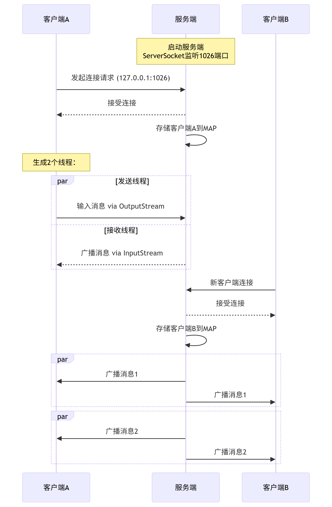
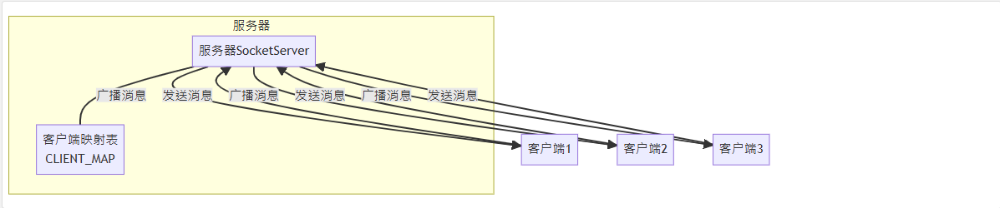

# talkie 後端學習筆記

## 初始化專案

🔗參考鏈接：https://coderlaoluo.feishu.cn/wiki/XrV6wZ7PliEeuak2NCXclC84nRf

### 手動創建 springboot 專案

打開專案文件夾，創建`src`目錄和`pom.xml`目錄。

最終專案結構如下

```txt
talkie/
├── src/
│   ├── java/
│   └── resources/
└── pom.xml
```

### pom.xml 所使用到的依賴

#### Maven 依賴列表

| 依賴 (Dependency)                | 版本 (Version) | 用途 (Purpose)                                               |
| :------------------------------- | :------------- | :----------------------------------------------------------- |
| `spring-boot-starter-web`        | 2.6.1          | Spring Boot Web Starter，用於構建基於 Spring MVC 的 Web 應用程式，包含內嵌的 Tomcat、Spring MVC 等核心組件。 |
| `spring-boot-starter-validation` | 2.6.1          | Spring Boot Validation Starter，提供 JSR-303/JSR-349 Bean Validation API 的實現，用於數據校驗。 |
| `spring-boot-starter-data-redis` | 2.6.1          | Spring Boot Redis Starter，用於整合 Spring Data Redis，方便在 Spring 應用中使用 Redis 作為數據緩存或消息代理。 |
| `mybatis-spring-boot-starter`    | 1.3.2          | MyBatis Spring Boot Starter，用於整合 MyBatis 持久層框架到 Spring Boot 應用中，簡化數據庫操作。 |
| `mysql-connector-java`           | 8.0.23         | MySQL JDBC Driver，用於 Java 應用程式連接 MySQL 數據庫。     |
| `logback-classic`                | 1.2.10         | Logback 日誌框架的核心模塊，提供日誌記錄功能。               |
| `logback-core`                   | 1.2.10         | Logback 日誌框架的核心基礎模塊。                             |
| `aspectjweaver`                  | 1.9.4          | AspectJ Weaver，提供 AOP (Aspect-Oriented Programming) 功能，用於在運行時織入切面。 |
| `okhttp`                         | 3.2.0          | OkHttp，一個高效的 HTTP 客戶端，用於發送 HTTP 請求和處理響應。 |
| `fastjson`                       | 1.2.66         | 阿里巴巴開源的高性能 JSON 庫，用於 Java 對象和 JSON 字符串之間的序列化和反序列化。 |
| `commons-lang3`                  | 3.4            | Apache Commons Lang 3，提供各種實用工具類，擴展了 Java 標準庫的功能，例如字符串操作、數組操作等。 |
| `commons-codec`                  | 1.9            | Apache Commons Codec，提供通用的編碼/解碼算法，例如 Base64、MD5、SHA1 等。 |
| `commons-io`                     | 2.5            | Apache Commons IO，提供 IO 操作的實用工具類，簡化文件和流的處理。 |
| `easy-captcha`                   | 1.6.2          | Easy Captcha，一個簡單易用的驗證碼生成庫。                   |
| `netty-all`                      | 4.1.50.Final   | Netty All，一個高性能、異步事件驅動的網絡應用程式框架，用於快速開發可維護的高性能協議服務器和客戶端。 |
| `redisson`                       | 3.12.3         | Redisson，一個基於 Redis 的 Java 驅動，提供豐富的分布式對象和服務，如分布式鎖、Map、Set 等。 |

## socket 初体验

### 使用 TCP 来建立一个简单的聊天室

#### 🌐 1. 为什么是TCP连接？

**典型的 TCP 连接**。原因：

- 使用 `ServerSocket` 和 `Socket` (Java TCP API)
- 基于流式传输（可靠、有序、基于连接）
- 使用 `accept()` 等待连接（TCP 三次握手）

#### 📊 2. 逻辑流程图



#### 🔄 3. 输入/输出流方向

| 角色       | 输出流 (OutputStream)                       | 输入流 (InputStream)                      |
| ---------- | ------------------------------------------- | ----------------------------------------- |
| **客户端** | **发送数据到服务端** (用户输入的消息)       | **接收服务端数据** (服务端广播的消息)     |
| **服务端** | **发送数据到客户端** (广播消息给所有客户端) | **接收客户端数据** (来自单个客户端的消息) |

**基本规则：**

-  写数据用 OutputStream → 发送数据
-  读数据用 InputStream → 接收数据

### 📦 4. 流的封装层次 (简化视图)

#### 客户端封装路径：

```
原始数据 (String)
    ↓
PrintWriter
    ↓
OutputStreamWriter (文本→字节)
    ↓
OutputStream (Socket.getOutputStream())
    ↓
TCP数据包 (通过网络传输)
```

#### 服务端封装路径：

```
TCP数据包 (来自网络)
    ↓
InputStream (Socket.getInputStream())
    ↓
InputStreamReader (字节→文本)
    ↓
BufferedReader (高效读取)
    ↓
处理后的字符串数据

```

## 什么是Socket？

Socket（套接字）是计算机网络中进程间通信的一种方式，它提供了一套标准的API，使不同计算机上的程序能够通过网络进行数据交换。

想象Socket就像电话系统：

- 服务器就像总机，有固定电话号码(IP地址+端口)
- 客户端就像拨打电话的人
- 通话建立后，双方可以自由交谈(数据交换)



## 聊天室的通信模型



### 服务端程序

首先，创建一个服务器程序，它会：

1. 监听特定端口
2. 接受客户端连接
3. 接收客户端消息
4. 将消息广播给所有连接的客户端

```java
package com.talkie.test;

import java.io.*;
import java.net.ServerSocket;
import java.net.Socket;
import java.util.HashMap;
import java.util.Map;

/**
 * @ClassName SocketServer
 * @Author Cecilia
 * @Date 2025/7/20
 * 使用通俗的例子来讲，这里相当于一个三大运营商的服务器（移动 / 电信 / 联通） 服务端
 * 接收客户端发送的消息，并发消息发送给目标用户
 */
public class SocketServer {
    public static void main(String[] args) {
        ServerSocket server = null;
        Map<String, Socket> CLIENT_MAP = new HashMap<>();
        int port = 1026;
        try {
            server = new ServerSocket(port);
            System.out.println("服务已启动，等待客户端连接");
            while (true) {
                Socket socket = server.accept(); // 调用 accept 方法等待客户端连接
                String ip = socket.getInetAddress().getHostAddress();
                System.out.println("有客户端链接ip：" + ip + "，端口" + socket.getPort());
                String clientKey = ip + socket.getPort();
                CLIENT_MAP.put(clientKey, socket);
                // 接收线程
                new Thread(() -> {
                    while (true) {
                        try {
                            InputStream inputStream = socket.getInputStream();
                            InputStreamReader inputStreamReader = new InputStreamReader(inputStream);
                            BufferedReader bufferedReader = new BufferedReader(inputStreamReader);
                            String readData = bufferedReader.readLine();
                            System.out.println("收到客户端消息->" + readData);

                            // 拿到所有的客户端
                            CLIENT_MAP.forEach((k, v) -> {
                                try {
                                    OutputStream outputStream = v.getOutputStream();
                                    PrintWriter printWriter = new PrintWriter(new OutputStreamWriter(outputStream, "UTF-8"));
                                    printWriter.println(socket.getPort() + ":" + readData);
                                    printWriter.flush();
                                } catch (Exception e) {
                                    e.printStackTrace();
                                }
                            });
                        } catch (Exception e) {
                            e.printStackTrace();
                            break;
                        }
                    }
                }).start();

            }
        } catch (Exception e) {
            e.printStackTrace();
        }
    }
}
```

#### 关于BufferedReader

`BufferedReader`是一个带缓冲的字符输入流。使用它的好处是：

1. 效率更高：减少了物理读取次数
2. 提供了`readLine()`方法，可以方便地读取一行文本
3. 处理各种字符编码

当客户端发送消息时，服务器通过`BufferedReader`的`readLine()`方法读取整行数据，然后广播给所有客户端。

### 客户端程序

接下来，创建客户端程序，它需要：

1. 连接到服务器
2. 创建一个线程发送消息
3. 创建另一个线程接收消息

```java
package com.talkie.test;

import java.io.*;
import java.net.Socket;
import java.util.Scanner;

/**
 * @ClassName SocketClient
 * @Author Cecilia
 * @Date 2025/7/20
 * 这里相当于一个用户（张三，李四......） 客户端，把客户端和服务端链接起来
 */
public class SocketClient {
    public static void main(String[] args) {
        Socket socket = null;
        try {
            socket = new Socket("127.0.0.1", 1026);
            OutputStream outputStream = socket.getOutputStream();
            PrintWriter printWriter = new PrintWriter(outputStream);
            System.out.println("请输入内容");
            new Thread(() -> {
                while (true) {
                    Scanner scanner = new Scanner(System.in);
                    String input = scanner.nextLine();
                    try {
                        printWriter.println(input);
                        printWriter.flush();
                    } catch (Exception e) {
                        e.printStackTrace();
                        break;
                    }
                }
            }).start();

            InputStream inputStream = socket.getInputStream();
            InputStreamReader inputStreamReader = new InputStreamReader(inputStream);
            BufferedReader bufferedReader = new BufferedReader(inputStreamReader);
            new Thread(() -> {
                while (true) {
                    try {
                        String readData = bufferedReader.readLine();
                        System.out.println("收到服务端消息" + readData);
                    } catch (Exception e) {
                        e.printStackTrace();
                        break;
                    }
                }
            }).start();
        } catch (Exception e) {
            e.printStackTrace();
        }
    }
}
```

## Java IO流的使用

在这个项目中，我们使用了几种不同的流：

1. **基础流**：
   - `InputStream`/`OutputStream`: 最基本的字节输入输出流
   - `InputStreamReader`/`OutputStreamWriter`: 将字节流转换为字符流
2. **缓冲流**：
   - `BufferedReader`: 提供高效的行读取功能
3. **便捷输出**：
   - `PrintWriter`: 提供方便的打印方法，如`println()`


## 核心代码片段

### 服务器端核心：

1. **创建服务器并接受客户端连接**

```java
ServerSocket server = new ServerSocket(port);
Socket socket = server.accept(); // 阻塞等待客户端连接
```

2. **管理多个客户端**

```java
Map<String, Socket> CLIENT_MAP = new HashMap<>();
String clientKey = ip + socket.getPort();
CLIENT_MAP.put(clientKey, socket);
```

3. **广播消息给所有客户端**

```java
CLIENT_MAP.forEach((k, v) -> {
    try {
        OutputStream outputStream = v.getOutputStream();
        PrintWriter printWriter = new PrintWriter(new OutputStreamWriter(outputStream, "UTF-8"));
        printWriter.println(socket.getPort() + ":" + readData);
        printWriter.flush();
    } catch (Exception e) {
        e.printStackTrace();
    }
});
```

### 客户端核心：

1. **连接到服务器**

```java
Socket socket = new Socket("127.0.0.1", 1026);
```

2. **发送消息**

```java
PrintWriter printWriter = new PrintWriter(outputStream);
printWriter.println(input);
printWriter.flush();
```

3. **接收消息**

```java
BufferedReader bufferedReader = new BufferedReader(inputStreamReader);
String readData = bufferedReader.readLine();
```

## 通用设计模式与思路

在开发聊天应用和其他网络通信程序时，以下是一些通用的设计模式和思路：

1. **服务器-客户端模型**：分离通信的两端，一方作为服务提供者，另一方作为消费者
2. **多线程处理**：
   - 服务器为每个客户端创建独立线程
   - 客户端分离读写操作到不同线程
3. **消息广播机制**：
   - 维护活跃连接列表
   - 实现消息转发到所有或特定客户端
4. **流式处理**：
   - 使用缓冲流提高效率
   - 建立流处理链（装饰器模式）
5. **异常处理**：
   - 捕获网络异常，优雅处理连接中断
   - 使用循环结构保持服务连续性


